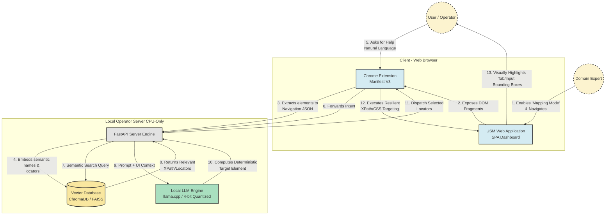

# USM AI Navigation Assistant - UML Architecture Diagram

This diagram outlines the detailed workflow and component architecture of the USM Navigation Assistant, matching the two phases specified in your original plan.

